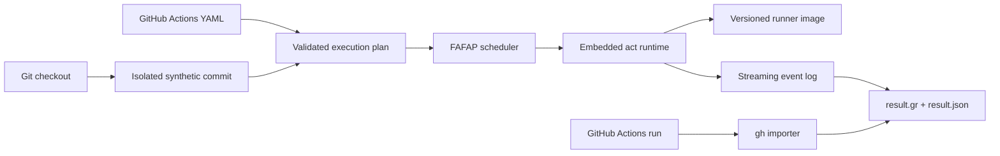

# Architecture

Greenrun is a local deterministic CI runtime. The coding agent already present
on the developer's machine supplies reasoning; Greenrun supplies execution and
evidence.

## FAFAP scheduler

The scheduler exists to minimize the expected time until the first useful
failure is observed.

- Every pending job from every triggered workflow enters one global queue.
  Each job executes as a single-job act plan against its workflow's shared
  parsed model, so dependency results and outputs propagate exactly as act
  evaluates `needs` and job-level conditions.
- The queue holds a weighted slot pool sized to the host (`--jobs`
  overrides). A matrix job reserves slots for its resolvable breadth, capped
  by the workflow's declared `max-parallel`. Higher-ranked jobs dispatch
  first; narrower jobs backfill slots a wide job cannot use.
- `internal/history` ranks each job by smoothed failure probability divided
  by expected detection time: recorded time-to-fail when the job has failed
  locally, recorded pass duration otherwise. The name heuristic seeds the
  prior, so cold-start ordering matches it, and the job that failed in the
  previous run is probed first. Imported `greenrun github` runs update the
  same statistics.
- The first failure cancels every running and queued job unless
  `run --complete` asked for the full failure set. Jobs torn down by that
  cancellation are reported `cancelled`, never `fail`.

## Boundaries

- `internal/repo`, `snapshot`, and `event` derive a realistic event without
  touching the developer's checkout.
- `internal/workflow` performs actionlint validation, trigger filtering,
  runner classification, dependency analysis, and initial ranking.
- `internal/history` turns recorded run evidence into the scheduler's
  ranking and learns from local and imported runs.
- `internal/engine` is the sole adapter to `nektos/act`. It owns the global
  job queue, cancellation, image selection, logs, caches, and artifact
  endpoints.
- `internal/store` persists canonical global run state.
- `internal/githubrun` normalizes remote Actions runs into the same result
  model.
- `internal/hook` manages the local git pre-push hook inside the git
  directory, never the checkout.

No package may read dotenv files implicitly or retrieve a GitHub token for
workflow execution. Tokens and secrets must be explicitly supplied.
