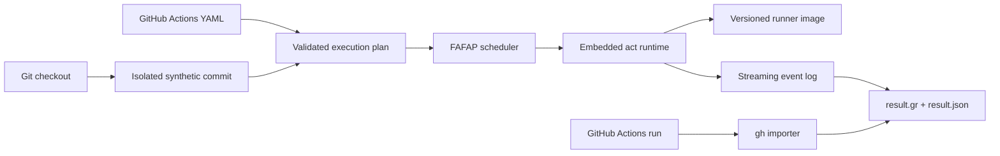

# Architecture

Greenrun is a local deterministic CI runtime. The coding agent already present
on the developer's machine supplies reasoning; Greenrun supplies execution and
evidence.

## Boundaries

- `internal/repo`, `snapshot`, and `event` derive a realistic event without
  touching the developer's checkout.
- `internal/workflow` performs actionlint validation, trigger filtering,
  runner classification, dependency analysis, and initial ranking.
- `internal/engine` is the sole adapter to `nektos/act`. It owns cancellation,
  image selection, logs, caches, and artifact endpoints.
- `internal/store` persists canonical global run state.
- `internal/githubrun` normalizes remote Actions runs into the same result
  model.

No package may read dotenv files implicitly or retrieve a GitHub token for
workflow execution. Tokens and secrets must be explicitly supplied.
